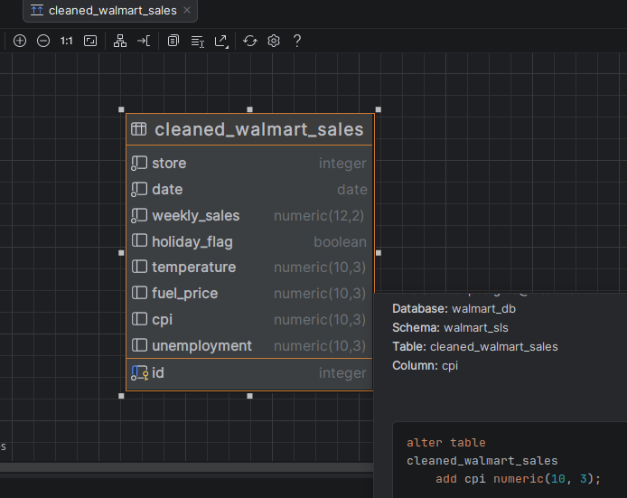
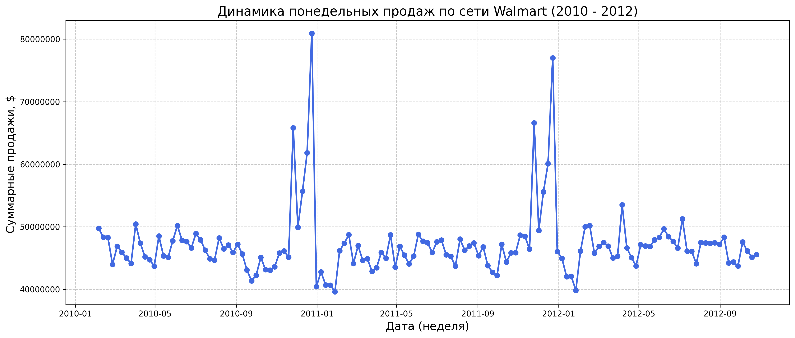
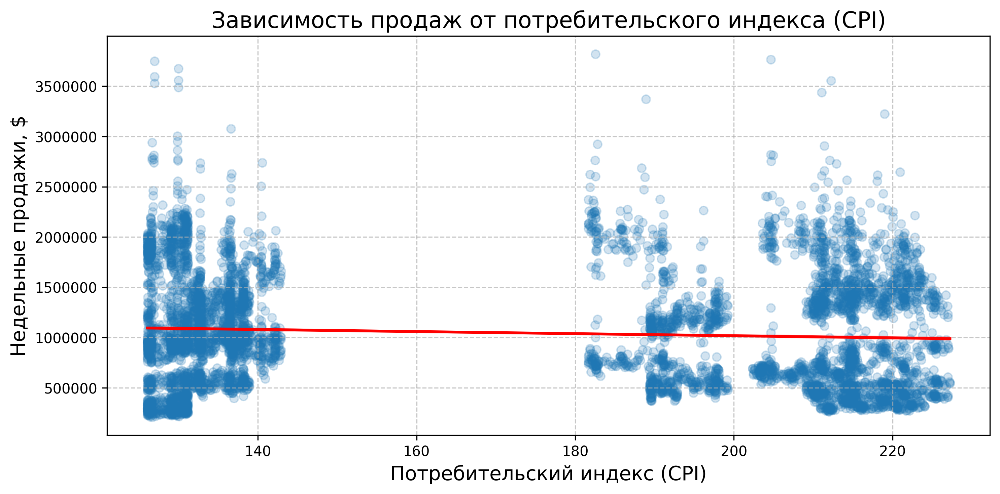
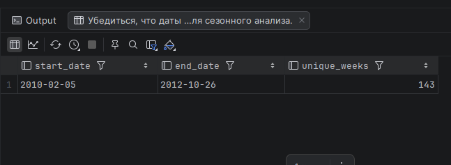

## 🌐 Языки

- 🇬🇧 [English version](README_EN.md) — coming soon
- 🇷🇺 Вы сейчас читаете русскую версию

# 📊 End-to-End Walmart Sales Analysis

## 📌 Описание проекта

Данный проект представляет собой комплексное end-to-end решение для анализа продаж Walmart и изучения влияния макроэкономических и сезонных факторов на доходы ритейлера. Проект охватывает полный жизненный цикл работы с данными:

* Проектирование и реализация схемы базы данных в **PostgreSQL**
* Очистка и трансформация данных с использованием **Python** (pandas)
* Исследовательский анализ данных (EDA) со статистическими инсайтами
* Интерактивные визуализации с помощью **matplotlib** и **seaborn**
* Бизнес-рекомендации на основе данных

Система позволяет заинтересованным сторонам понять, как внешние факторы, такие как праздники, погодные условия, цены на топливо, уровень безработицы и индекс потребительских цен (CPI), влияют на эффективность продаж в различных регионах и временных периодах.

---

## 📌 Бизнес-задача

В качестве аналитика данных в департаменте продаж крупного ритейлера необходимо исследовать, как макроэкономические и сезонные факторы влияют на доход компании. Цель анализа — разработать практические рекомендации для адаптации стратегии продаж в зависимости от внешних условий.

Проект решает следующие ключевые бизнес-вопросы:

1. **Сезонное влияние** - Как праздники и сезоны влияют на объем продаж по всей торговой сети?
2. **Макроэкономическое влияние** - Какова взаимосвязь между экономическими показателями (CPI, безработица) и эффективностью продаж?
3. **Внешние факторы** - Как погодные условия и цены на топливо влияют на покупательское поведение?
4. **Стратегические рекомендации** - Какие стратегии на основе данных должна внедрить компания для оптимизации продаж?

---

## 🛠️ Подход к решению

### Понимание индекса потребительских цен (CPI)

Индекс потребительских цен — это важный экономический показатель, который измеряет изменение уровня цен на корзину потребительских товаров и услуг во времени. Он отражает изменение покупательной способности потребителей.

**Формула CPI:**

$$CPI_t = \frac{C_t}{C_0} \times 100$$

Где:
* **CPI_t** — индекс потребительских цен в текущем периоде (t)
* **C_t** — стоимость потребительской корзины в текущем периоде (t)
* **C_0** — стоимость потребительской корзины в базовом периоде (0)

CPI является ключевой переменной в данном анализе, так как напрямую влияет на покупательную способность потребителей и модели расходов.

---

## 📂 Структура проекта

```
walmart-sales-analysis/
│
├── src/
│   ├── PostgreSQL/
│   │   ├── DDL/
│   │   │   └── walmart_sls_DDL.sql         # Создание схемы БД
│   │   └── DML/
│   │       └── walmart_sls_DML.sql         # Запросы для работы с данными
│   │
│   ├── datasets/
│   │   ├── row/
│   │   │   └── walmart_sls_row.csv         # Исходные данные
│   │   └── clean/
│   │       └── walmart_sls_clean.csv       # Очищенный датасет
│   │
│   ├── docs/
│   │   ├── business_problem.docx           # Требования проекта
│   │   ├── walmart_erd_model.png           # ERD диаграмма БД
│   │
|   ├── notebooks/
|   |   ├── key_insights.ipynb              # Ключевые инсайты
|   |   ├── walmart_analysis.ipynb          # Полная аналитика
|   |
│   ├── report/
│   |   ├── walmart_report.pptx             # Итоговая презентация
|   |
|   └── requirements.txt                    # Версия модулей для установки в виртуальное окружение  
│
├── README_RU.md                            # Документация проекта
└── .gitignore                              # Правила игнорирования Git
```

---

## ⚙️ Как запустить проект

### 1. Клонируйте репозиторий

```bash
git clone https://github.com/diyorIsamukhamedov/walmart-sales-analysis.git
cd walmart-sales-analysis
```

### 2. Настройте базу данных

Создайте схему базы данных в PostgreSQL:

```bash
psql -U your_username -d your_database -f src/PostgreSQL/DDL/walmart_sls_DDL.sql
```

### 3. Загрузите данные

Выполните DML скрипты для загрузки и работы с данными:

```bash
psql -U your_username -d your_database -f src/PostgreSQL/DML/walmart_sls_DML.sql
```

### 4. Запустите Python-анализ

Установите необходимые зависимости:

```bash
pip install pandas matplotlib seaborn
```

Запустите Jupyter notebook для исследовательского анализа:

```bash
jupyter walmart_analysis.ipynb.ipynb
```

---

## 🗂️ Схема базы данных (ERD)

База данных построена по нормализованной реляционной модели для эффективного хранения и запросов данных о продажах с учетом связанных внешних факторов.



---

## 📊 Описание данных

| Столбец | Описание |
|---------|----------|
| `Store` | Идентификационный номер магазина |
| `Date` | Дата начала недели продаж |
| `Weekly_Sales` | Выручка от продаж за неделю (в долларах США) |
| `Holiday_Flag` | Бинарный индикатор праздничных недель (1 = праздник, 0 = обычная неделя) |
| `Temperature` | Средняя температура в регионе (°F) |
| `Fuel_Price` | Цена топлива в регионе (USD за галлон) |
| `CPI` | Индекс потребительских цен |
| `Unemployment` | Уровень безработицы в регионе (%) |

---

## 📈 Ключевые этапы анализа

### Шаг 1: Подготовка данных
* Преобразование типов данных и валидация
* Анализ пропущенных значений и стратегия их обработки
* Оценка качества данных

### Шаг 2: Исследовательский анализ данных (EDA)

**Сезонное влияние и влияние праздников:**
* Анализ паттернов продаж в праздничные и обычные недели
* Визуализация динамики еженедельных продаж в течение года
* Определение периодов пиковых продаж

**Макроэкономические факторы:**
* Корреляционный анализ между CPI, безработицей и продажами
* Статистическое тестирование для определения значимых взаимосвязей
* Визуализация трендов экономических индикаторов

### Шаг 3: Анализ внешних факторов

**Погода и цены на топливо:**
* Оценка влияния изменений температуры на продажи
* Корреляция цен на топливо с покупательским поведением
* Региональные различия в чувствительности к внешним факторам

### Шаг 4: Бизнес-рекомендации

Стратегии оптимизации продаж на основе данных:
* Сезонные тренды и планирование праздников
* Мониторинг экономических условий
* Региональные стратегии адаптации

---

## 📊 Примеры визуализаций

Анализ включает следующие типы визуализаций:

* **Столбчатые диаграммы** - Сравнение общих и средних продаж по сезонам (Winter, Spring, Summer, Autumn), а также анализ влияния праздничных недель на выручку
* **Линейные графики (временные ряды)** - Динамика понедельных продаж по сети Walmart (2010-2012) и средние продажи по неделям календарного года (недели 1-52) для выявления сезонных пиков
* **Диаграммы рассеяния с линиями тренда** - Визуализация зависимости продаж от макроэкономических факторов (CPI, безработица) и внешних условий (температура, цены на топливо) с расчетом коэффициентов корреляции Пирсона




---

## 🔍 Пример SQL-запроса

Убедиться, что даты охватывают год или несколько лет — для сезонного анализа.

```sql
SELECT
	min(date) AS start_date,
	max(date) AS end_date,
	count(DISTINCT date) AS unique_weeks
FROM walmart_sls.cleaned_walmart_sales;
```


---

## 🦾 Используемые технологии

* **PostgreSQL** – Система управления реляционными базами данных
* **Python** (pandas, numpy, venv) – Очистка, трансформация, анализ данных и управление модулями в виртуальном пространстве.
* **Matplotlib** – Визуализация данных и построение графиков
* **Seaborn** – Статистическая визуализация данных
* **Jupyter Notebook** – Интерактивная среда разработки
* **Git/GitHub** – Контроль версий и совместная работа

---

## 📌 Ключевые результаты

| Бизнес-вопрос | Метод анализа | Ключевая находка |
|---------------|---------------|------------------|
| Как праздники влияют на продажи? | Анализ временных рядов с сравнением праздничных флагов | ✅ Определены конкретные праздничные периоды со значительным ростом продаж |
| Какие экономические факторы важнее всего? | Корреляционный анализ и регрессионное моделирование | ✅ Установлено измеримое влияние CPI и безработицы на продажи |
| Влияют ли погодные условия на покупки? | Региональный анализ с корреляцией температуры | ✅ Обнаружены региональные вариации в чувствительности к погоде |
| Как цены на топливо влияют на поведение? | Корреляционный анализ с временным лагом | ✅ Установлена взаимосвязь между стоимостью топлива и паттернами продаж |
| Какие стратегии следует внедрить? | Фреймворк рекомендаций на основе данных | ✅ Разработаны практические стратегии для сезонной и экономической адаптации |

---

## 🎯 Бизнес-рекомендации

На основе комплексного анализа рекомендуются следующие стратегии:

1. **Сезонное планирование** - Увеличение запасов и маркетинговых усилий в выявленные пиковые сезоны и праздничные периоды
2. **Экономический мониторинг** - Внедрение систем отслеживания CPI и безработицы для прогнозирования колебаний продаж
3. **Региональная адаптация** - Кастомизация стратегий на основе местных погодных паттернов и чувствительности к ценам на топливо
4. **Динамическое ценообразование** - Корректировка ценовых стратегий в ответ на макроэкономические индикаторы
5. **Планирование промоакций** - Согласование промо-кампаний с периодами экономической стабильности и благоприятных условий

---

## 📝 Будущие улучшения

* Интеграция с API для получения экономических данных в реальном времени
* Модели машинного обучения для прогнозирования продаж
* Разработка интерактивного дашборда с использованием Power BI или Tableau
* Расширение анализа за счет включения данных о конкурентах
* Внедрение автоматических уведомлений о значительных экономических изменениях

---

## 👨‍💻 Автор

**Разработчик:** [Diyor Isamukhamedov](https://github.com/diyorIsamukhamedov)

**Контакт:** diyor.isamukhamedov@gmail.com

---